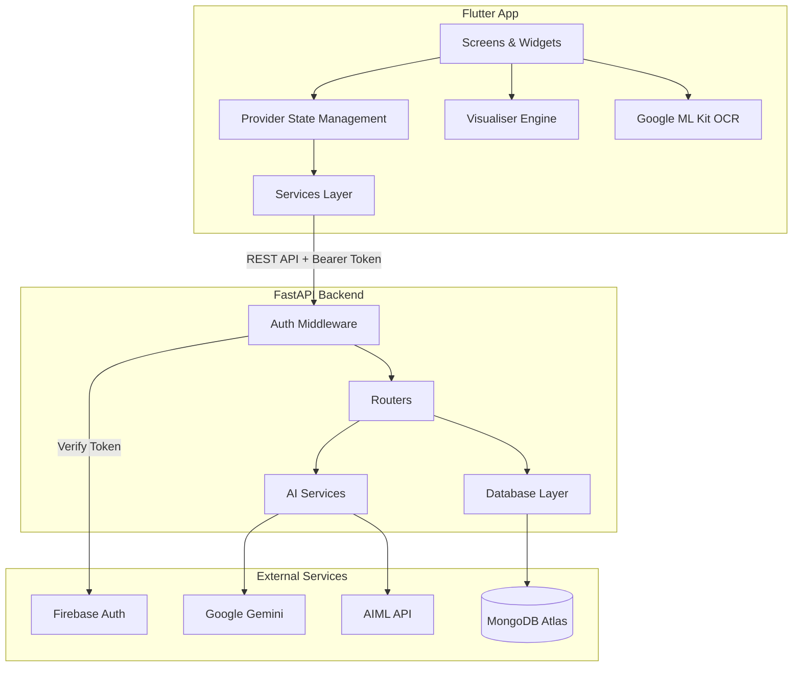
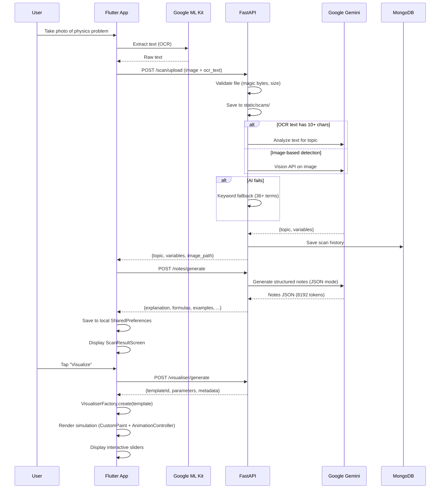
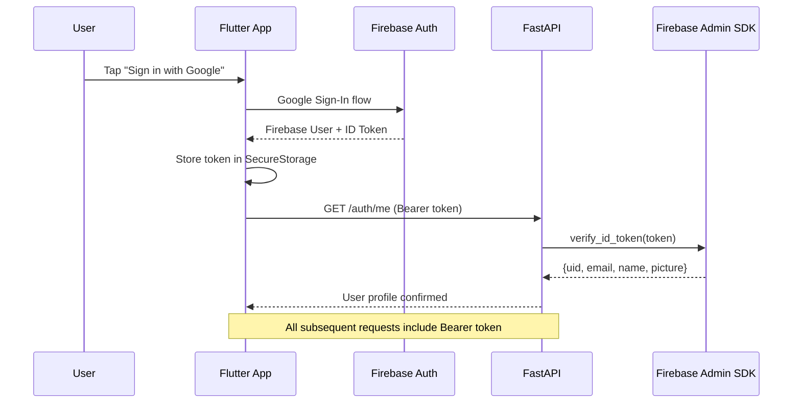
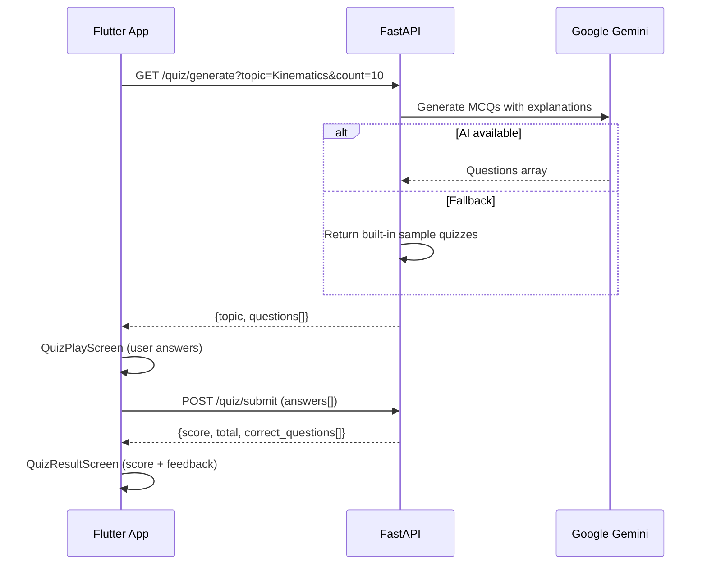
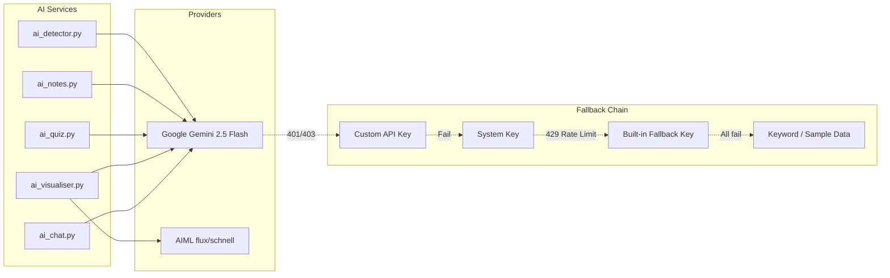

# Architecture

Technical architecture reference for Stemly contributors.

## High-Level Overview



## Component Breakdown

### Flutter App (`stemly_app/lib/`)

```
lib/
├── main.dart                       # Entry point, route definitions, providers
├── firebase_options.dart           # Generated Firebase config
│
├── services/                       # Backend communication
│   ├── firebase_auth_service.dart  # Auth + token management (ChangeNotifier)
│   └── groq_service.dart           # Multi-AI provider abstraction (ChangeNotifier)
│
├── screens/                        # Full-page UI
│   ├── splash_screen.dart          # Init, auth check
│   ├── main_screen.dart            # Camera scan + upload
│   ├── scan_result_screen.dart     # Notes + actions after scan
│   ├── history_screen.dart         # Past scans list
│   ├── history_detail_screen.dart  # Single scan detail
│   ├── settings_screen.dart        # Theme, API keys, preferences
│   └── account_screen.dart         # Profile, sign-out
│
├── models/
│   └── scan_history.dart           # ScanHistory data model
│
├── storage/
│   └── history_store.dart          # SharedPreferences persistence (singleton)
│
├── visualiser/                     # Physics simulation engine
│   ├── visualiser_factory.dart     # Factory: templateId → Widget
│   ├── visualiser_models.dart      # VisualTemplate, TemplateParameter
│   ├── visualiser_api.dart         # Backend API calls
│   ├── visualiser_screen.dart      # Simulation container + sliders
│   ├── projectile_motion.dart      # Trajectory simulation
│   ├── free_fall_component.dart    # Drop simulation
│   ├── shm_component.dart          # Spring/oscillation
│   ├── kinematics_component.dart   # Motion equations
│   ├── optics_component.dart       # Lens ray tracing
│   ├── atom_component.dart         # Atomic structure
│   ├── graph_component.dart        # Quadratic plotter
│   ├── equation_plotter.dart       # General math plotter
│   └── generic_diagram.dart        # Primitive shapes renderer
│
├── quiz/
│   ├── quiz_play_screen.dart       # MCQ interface
│   └── quiz_result_screen.dart     # Score + feedback
│
├── theme/
│   └── theme_provider.dart         # Light/dark/system (ChangeNotifier)
│
└── widgets/
    └── bottom_nav_bar.dart         # Curved navigation bar
```

**State management**: Provider with `ChangeNotifier`. Three global providers (`FirebaseAuthService`, `ThemeProvider`, `GroqService`) injected at the app root.

**Navigation**: Named routes via `onGenerateRoute` with custom fade+slide transitions.

**Local storage**: `SharedPreferences` for scan history (max 20 items), `FlutterSecureStorage` for auth tokens and API keys.

### FastAPI Backend (`backend/`)

```
backend/
├── main.py              # App init, CORS, router registration
├── config.py            # Env vars, Gemini config, model URLs
│
├── auth/
│   ├── firebase.py          # Token verification via firebase-admin
│   ├── auth_middleware.py   # require_firebase_user dependency
│   └── auth_router.py      # GET /auth/me
│
├── routers/
│   ├── scan.py              # POST /scan/upload, GET /scan/history, /scan/ping
│   ├── notes.py             # POST /notes/generate, POST /notes/ask
│   ├── visualiser.py        # POST /visualiser/generate, states, chat, image
│   ├── visualiser_engine.py # POST /visualiser/generate, /visualiser/update
│   ├── quiz_router.py       # GET /quiz/questions, /quiz/generate, POST /quiz/submit
│   └── chat.py              # POST /chat/ask
│
├── services/
│   ├── ai_detector.py       # Topic detection (vision → text → keyword fallback)
│   ├── ai_notes.py          # Notes generation via Gemini (JSON mode)
│   ├── ai_quiz.py           # Quiz generation with fallback samples
│   ├── ai_visualiser.py     # Parameter adjustment + image generation
│   ├── ai_chat.py           # Conversational AI (Gemini/Ollama)
│   ├── storage.py           # File upload with magic-byte validation
│   ├── quiz_service.py      # Static quiz dataset + evaluation
│   └── history_service.py   # In-memory history (legacy)
│
├── database/
│   ├── db.py                # Motor async client, optional MongoDB
│   ├── user_model.py        # User upsert
│   ├── history_model.py     # Scan history CRUD
│   ├── notes_model.py       # Notes persistence
│   └── visualiser_model.py  # Visualiser state persistence
│
└── models/
    ├── quiz.py              # QuizQuestion, QuizSubmission Pydantic models
    ├── notes_models.py      # NotesRequest, NotesResponse
    └── visualiser_models.py # TemplateRequest, ParameterUpdate
```

**Design principles**:
- Routers are thin — they validate input and delegate to services
- Services contain all AI/business logic
- Database layer is optional — the app degrades gracefully without MongoDB
- Every protected endpoint uses `Depends(require_firebase_user)`

## Data Flows

### Scan-to-Simulation Pipeline

This is Stemly's core flow — from a camera photo to an interactive physics simulation.



### Authentication Flow



### Quiz Flow



## AI Service Architecture

Stemly integrates multiple AI providers with a resilience-first approach.



**Resilience patterns**:
- 3 retries with exponential backoff (1s, 3s, 7s)
- Automatic key rotation on auth failures
- Keyword-based topic detection as ultimate fallback
- Sample quiz data when Gemini is unavailable
- Graceful JSON parsing with multiple extraction strategies

## Visualiser Engine (Frontend)

The visualiser uses a factory pattern to map backend templates to Flutter widgets.

```
VisualiserFactory.create(templateId) → Widget

templateId mapping:
  "projectile_motion"  → ProjectileMotionWidget
  "free_fall"          → FreeFallWidget
  "simple_harmonic"    → SHMWidget
  "kinematics"         → KinematicsWidget
  "optics"             → OpticsWidget
  "atom_structure"     → AtomWidget
  "quadratic_graph"    → GraphWidget
  "equation_plotter"   → EquationPlotterWidget
  *                    → GenericDiagramWidget
```

Each simulation widget:
1. Receives a `VisualTemplate` with parameters (value, min, max)
2. Uses `AnimationController` for time-based physics
3. Renders via `CustomPainter` on a `Canvas`
4. Exposes parameter sliders that update simulation in real-time
5. Reports statistics (range, velocity, height) via callbacks

## Database Schema

MongoDB collections in `stemly_db`:

```
users
├── uid: string (Firebase UID, indexed)
├── email: string
├── name: string
├── picture: string (avatar URL)
└── last_login: datetime

scan_history
├── _id: ObjectId
├── user_id: string (Firebase UID)
├── topic: string
├── variables: string[]
├── image_path: string
├── ocr_text: string
└── timestamp: datetime

visualiser_states
├── _id: ObjectId
├── user_id: string
├── template_id: string
├── parameters: object
└── saved_at: datetime

notes
├── _id: ObjectId
├── user_id: string
├── topic: string
├── content: object (full notes JSON)
└── created_at: datetime
```

Note: MongoDB is optional. When `MONGO_URI` is not set, the backend continues to function — database write operations are silently skipped and the app relies on the Flutter client's local storage.

## Security Model

| Layer | Mechanism |
|-------|-----------|
| Transport | HTTPS (enforced by Vercel in production) |
| Authentication | Firebase ID tokens, verified via `firebase-admin` SDK |
| Authorization | User isolation — all queries filtered by `uid` from token |
| File upload | Magic-byte validation (PNG/JPEG only), 5 MB limit |
| API keys | User keys passed via `X-AI-API-Key` header, never stored server-side |
| Secrets | `.env` for server secrets, `FlutterSecureStorage` on client |
| CORS | Open in development (`*`), should be restricted in production |

## Deployment

```
Production:
  Backend  → Vercel (serverless Python, configured via vercel.json)
  Database → MongoDB Atlas (cloud)
  Auth     → Firebase (cloud)
  Frontend → Built APK / App Bundle distributed to devices

Local Development:
  Backend  → uvicorn --reload (port 8000)
  Database → Docker MongoDB or Atlas
  Frontend → flutter run (connects to 10.0.2.2:8080 on Android emulator)
```
