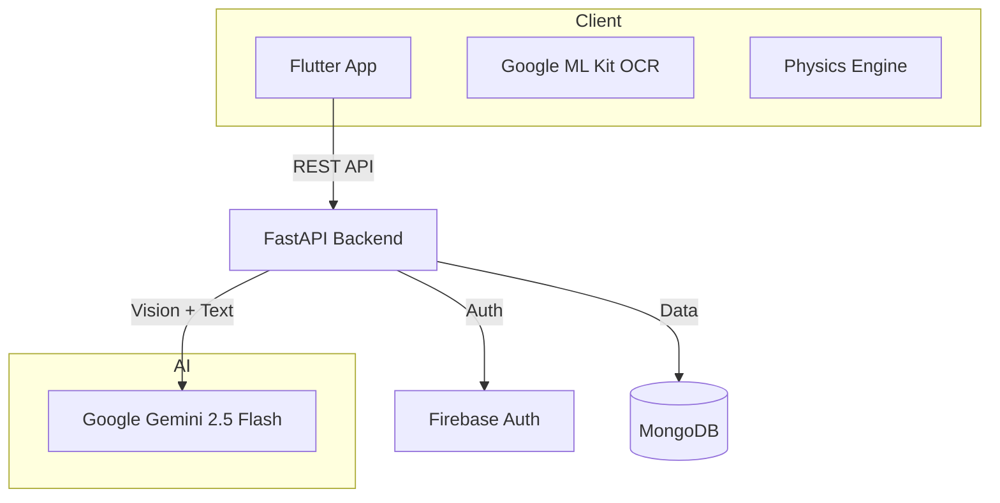

<p align="center">
  <h1 align="center">Stemly</h1>
  <p align="center"><strong>Scan. Analyze. Visualize. Study.</strong></p>
  <p align="center">
    An AI-powered STEM learning platform that transforms diagrams and problems into interactive simulations, study notes, and smart quizzes.
  </p>
</p>

<p align="center">
  <a href="../../actions/workflows/flutter-ci.yml"></a>
  <a href="../../actions/workflows/backend-ci.yml"></a>
  <a href="LICENSE"></a>
  <a href="../../graphs/contributors"></a>
  <a href="../../commits/master"></a>
</p>

<p align="center">
  
  
  
  
  
  
</p>

---

## The Problem

Students struggle to visualize abstract STEM concepts from textbooks and static diagrams. Traditional tools offer either theory OR visuals, rarely both in an interactive, personalized way.

## Our Solution

Scan any physics problem with your phone, and Stemly instantly generates:

- **AI Visualiser** — Real-time, parameter-driven physics simulations with interactive sliders  
- **AI Notes** — Comprehensive study notes with formulas, examples, and resources  
- **Smart Quizzes** — Auto-generated MCQs to test understanding immediately  
- **AI Tutor** — Chat with Gemini, GPT-4o, Grok, or Llama 3 for personalized help  

---

## Demo

<div align="center">

| Welcome | Scan & Loading | Main Interface |
|:---:|:---:|:---:|
|  |  |  |

| AI Visualiser | AI Notes | Settings |
|:---:|:---:|:---:|
|  |  |  |

</div>

---

## Features

### AI Visualiser — Not Just a Video

A real-time physics engine with:

- Interactive control via sliders (velocity, angle, gravity, resistance)  
- Natural language control — ask "What if gravity was 0?" and watch it update  
- Live graphs (velocity-time, position-time, acceleration-time)  
- 9+ simulations: Projectile Motion, SHM, Optics, Kinematics, Free Fall, and more  

### AI Notes — Study Smarter

Generated specifically for each scanned problem:

- Concept breakdowns with simple explanations  
- Key formulas with physical meanings  
- Step-by-step worked examples  
- Curated resources from across the web  

### Smart Quizzes

- Instantly generated from your scanned content  
- Multiple-choice with detailed explanations  
- Score tracking and feedback  

### Multi-Provider AI Tutor

Choose your preferred AI model:

- Google Gemini (default)  
- xAI Grok  
- OpenAI GPT-4o  
- Groq Llama 3  

---

## Architecture



| Layer | Technology |
| :--- | :--- |
| Frontend | Flutter 3.x, Dart, Provider, CustomPaint (60 FPS rendering) |
| Backend | FastAPI, Python 3.10+, Uvicorn, Pydantic |
| AI | Google Gemini 2.5 Flash (vision + text + JSON mode) |
| Database | MongoDB Atlas (async via Motor) |
| Auth | Firebase Authentication (Google Sign-In, email/password) |
| Deployment | Vercel (backend), APK/IPA (frontend) |

See `ARCHITECTURE.md` for detailed component diagrams, data flows, and the scan-to-simulation pipeline.

---

## Quick Start

### Prerequisites

- Flutter 3.x+ and Dart SDK 3.10.1+
- Python 3.10+
- API keys: Google Gemini + Firebase + MongoDB Atlas

### Setup

```bash
git clone https://github.com/SH-Nihil-Mukkesh-25/Stemly.git
cd Stemly

# Backend
cd backend
python -m venv .venv && source .venv/bin/activate  # Windows: .venv\Scripts\activate
pip install -r requirements.txt
cp .env.example .env   # Fill in your API keys
uvicorn main:app --reload

# Flutter (in a new terminal)
cd stemly_app
flutter pub get
flutter run
```

For detailed instructions (platform-specific, Docker, etc.), see the Setup Guide.

---

## Documentation

| Document | Description |
| :--- | :--- |
| **Architecture** | System design, component diagrams, data flows |
| **API Reference** | Complete REST API documentation with examples |
| **Setup Guide** | Getting API keys, platform setup, Docker |
| **Development Guide** | Git workflow, testing, debugging, adding simulations |
| **Contributing** | How to contribute, code style, PR process |
| **FAQ** | Common questions answered |
| **Roadmap** | Where Stemly is headed |

---

## Roadmap

See `docs/ROADMAP.md` for the full roadmap.

- **Next**: Wave simulations, circuit builder, chemistry support, offline mode
- **Later**: Web deployment, multi-language support, classroom mode, AR features
- **Vote**: React on issues to prioritize features

---

## Contributing

We welcome contributions from everyone — especially students and first-time open-source contributors!

1. Read the **Contributing Guide**
2. Look for `good first issue` labels
3. Set up your environment with the **Setup Guide**
4. Pick an issue and submit a PR

---

## Team

Stemly was built by **Team Mugiwara Coders** — CS students from Amrita Vishwa Vidyapeetham, Coimbatore.

| Name | Role | GitHub |
| :--- | :--- | :--- |
| P Dakshin Raj | Frontend & Flutter Lead | @Dakshin10 |
| SH Nihil Mukkesh | Backend & AI Lead | @SH-Nihil-Mukkesh-25 |
| SHRE RAAM P J | Content & Ideation | @SHRE-RAAM-P-J |
| Vibin Ragav S | Testing | @VibinR-code |

### Contributors

<a href="../../graphs/contributors">  </a>

---

## Community

- **Questions?** Open a discussion or ask an issue
- **Found a bug?** Report it
- **Have an idea?** Request a feature
- **Security issue?** See `SECURITY.md`

## License

Stemly is open-source under the MIT License.

<div align="center"> <strong>Transforming STEM education, one scan at a time.</strong> <br><br> <a href="../../stargazers">Star this repo</a> if you find it useful! </div>
